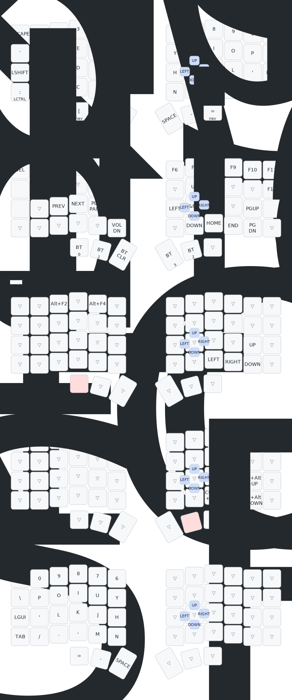

# Silakka54 ZMK Configuration

A ZMK firmware configuration for the **Silakka54** split ergonomic keyboard.

## Overview

The Silakka54 is a 54-key split keyboard using a native `silakka54` ZMK shield/keymap. The layout is modeled directly as 54 physical positions (no compatibility dead slots).

### Hardware

- **Controller**: nice!nano
- **Display**: nice!view
- **Layout**: Split ergonomic (54 keys)
- **Features**: Bluetooth, deep sleep, mouse emulation

## Layers

The keymap includes 6 active layers:

| Layer | Name | Description |
|-------|------|-------------|
| 0 | `base` | Base typing layer |
| 1 | `overflow` | Fn/media/Bluetooth + Studio unlock |
| 2 | `nav` | Navigation layer (arrows + Alt+Tab + Alt+F4) |
| 3 | `desktop-move` | Desktop-move layer (Ctrl+Alt arrows) |
| 4 | `onehand-mirror` | One-shot mirrored right-hand typing layer |
| 5 | `mouse` | Hold-on-`1`/`0` mouse layer for cursor movement and buttons |

## Features

### Hold-tap layer access

- `1`: tap for `1`, hold for the `mouse` layer.
- `0`: tap for `0`, hold for the `mouse` layer.
- `[` and `=`: tap for key, hold for `nav` layer.
- `]`: tap for key, hold for `overflow` layer.
- `-`: tap for key, hold for `desktop-move` layer.
- `TD(1)` remains on `]`:
  - Tap `]`
  - Hold for `overflow`
  - Double-tap enables one-shot `onehand-mirror` for the next keypress, then returns to base

### Mirrored direction cluster

On both mirrored layers, the visible direction cluster is on `, . / '`:

- `, . / '` on `nav` -> Left / Right / Down / Up arrows
- `, . / '` on `desktop-move` -> Ctrl+Alt+Left / Right / Down / Up

Additional `nav` bindings:
- `Tab` -> Alt+Tab

### Mouse layer

While holding `1` or `0`, the left-hand alpha cluster becomes mouse controls:

- `A / Z / X / C` -> Up / Down / Left / Right cursor movement
- `S / D / F` -> Left / Middle / Right mouse button

Movement uses ZMK mouse movement bindings, so it continues while held. Mouse buttons use ZMK mouse key press behavior, so holds map to press/release semantics.

### Screenshot behavior

- `TD(0)`: tap `PrintScreen`, double-tap `M2` (Shift+Alt+PrintScreen)

### Combos

- `H + J -> Left`
- `J + U -> Up`
- `J + K -> Right`
- `J + M -> Down`

### Alt shortcuts on base layer

- Hold `Alt` + tap `2` -> `Alt+F2`
- Hold `Alt` + tap `4` -> `Alt+F4`
- Hold `Alt` + tap `;` -> `Alt+Tab`

### Fn usage + Studio unlock

- `overflow` still carries media/Bluetooth keys and `studio_unlock`.

### Bluetooth

- Profiles on `overflow` (`BT_SEL 0..3`)
- Clear bonding via `BT_CLR`

### Display / power

- nice!view support enabled
- Deep sleep enabled (`CONFIG_ZMK_SLEEP=y`)

## Keymap Visualization

Generated layout docs are committed under `docs/generated/`.

- Regenerate YAML + SVG: `make keymap-svg`
- Canonical rendered keymap: [`docs/generated/silakka54.svg`](docs/generated/silakka54.svg)



## Building

Firmware is built automatically via GitHub Actions. Push to the repository to trigger a build.

The workflow generates firmware for:
- `silakka54_left` with nice!view
- `silakka54_right` with nice!view
- `settings_reset` (for clearing bond information)

### Local Build (Docker)

Requirements:
- Docker
- GNU Make

Run:

```bash
make build
```

Outputs are written to `artifacts/`:
- `artifacts/silakka54_left.uf2`
- `artifacts/silakka54_right.uf2`
- `artifacts/settings_reset.uf2`

GitHub Actions uses the same `make build` path.

## Installation

1. Download the firmware artifacts from GitHub Actions
2. Put your nice!nano into bootloader mode (double-tap reset)
3. Copy the `.uf2` file to the mounted drive
4. Repeat for the other half

## File Structure

```
├── .github/
│   └── workflows/
│       └── build.yml       # GitHub Actions workflow
├── config/
│   ├── silakka54.conf      # ZMK configuration options
│   ├── silakka54.keymap    # Keymap definition
│   ├── macros.dtsi         # Macro definitions
│   ├── boards/shields/silakka54/ # Native Silakka54 shield definition
│   └── west.yml            # West manifest
├── build.yaml              # Build matrix configuration
└── README.md
```

## Resources

- [ZMK Documentation](https://zmk.dev/docs)
- [ZMK Keycodes](https://zmk.dev/docs/keymaps/behaviors)
- [nice!nano Documentation](https://nicekeyboards.com/docs/nice-nano/)
- [nice!view Documentation](https://nicekeyboards.com/docs/nice-view/)

## License

This configuration is provided as-is for personal use with the Silakka54 keyboard.