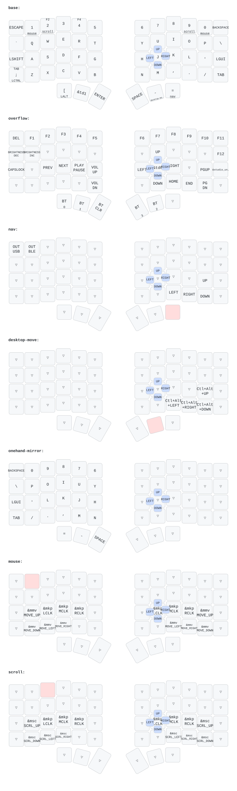

# Silakka54 ZMK Configuration

A ZMK firmware configuration for the **Silakka54** split ergonomic keyboard.

## Overview

The Silakka54 is a 54-key split keyboard using a native `silakka54` ZMK shield/keymap. The layout is modeled directly as 54 physical positions (no compatibility dead slots).

Both keyboard halves are BLE peripherals. A switchless USB-powered dongle is the
split central for both halves, runs the keymap, and provides USB/BLE host output
and ZMK Studio over USB. The dongle is required; neither half is a standalone
central. The existing matrix, 54-key transform, and nice!view screens are retained.

### Dongle hardware restriction

**`silakka54_dongle_nosd.uf2` is ONLY for nice!nano UF2 Bootloader 0.6.0
with no SoftDevice**, confirmed on dongle serial `9334726186A3C03E`.
Its application starts at `0x1000`, not standard nice!nano's `0x26000`.
Code occupies `0x1000..0xEC000`; settings remain at `0xEC000..0xF4000`.
**Never flash this image on an ordinary nice!nano with S140 installed.**
The dedicated `silakka54_dongle_nosd` shield/artifact names isolate this
hardware-specific layout while reusing the compatible `nice_nano` board drivers.
No generic dongle image or S140 dongle target is provided.

### Hardware

- **Controller**: nice!nano
- **Display**: nice!view
- **Layout**: Split ergonomic (54 keys)
- **Features**: Bluetooth, deep sleep, mouse emulation

## Layers

The keymap includes 7 active layers:

| Layer | Name | Description |
|-------|------|-------------|
| 0 | `base` | Base typing layer |
| 1 | `overflow` | Fn/media/Bluetooth + Studio unlock |
| 2 | `nav` | Navigation layer (arrows + Alt+Tab + Alt+F4) |
| 3 | `desktop-move` | Desktop-move layer (Ctrl+Alt arrows) |
| 4 | `onehand-mirror` | One-shot mirrored right-hand typing layer |
| 5 | `mouse` | Hold-on-`1`/`0` mouse layer for cursor movement and buttons |
| 6 | `scroll` | Hold-on-`2`/`9` scroll layer with mirrored wheel controls |

## Features

### Hold-tap layer access

- `1`: tap for `1`, hold for the `mouse` layer.
- `0`: tap for `0`, hold for the `mouse` layer.
- `2`: tap for `2` (still `Alt+F2` when `Alt` is held), hold for the `scroll` layer.
- `9`: tap for `9`, hold for the `scroll` layer.
- `[` and `=`: tap for key, hold for `nav` layer.
- `]`: tap for key, hold for `overflow` layer.
- `-`: tap for key, hold for `desktop-move` layer.
- `TD(1)` remains on `]`:
  - Tap `]`
  - Hold for `overflow`
  - Double-tap enables one-shot `onehand-mirror` for the next keypress, then returns to base

### Mirrored direction cluster

On both mirrored layers, the visible direction cluster is on `, . / '`:

- `, . / '` on `nav` -> Left / Right / Down / Up arrows
- `, . / '` on `desktop-move` -> Ctrl+Alt+Left / Right / Down / Up

Additional `nav` bindings:
- Hold the rightmost thumb `=` key, then tap the top-left `Esc` position -> select USB output.
- Hold `=` and tap the `1` position (next to `Esc`) -> select BLE output.
- Output selection is silent; it does not turn Bluetooth off, which remains enabled for the split link.
- `Tab` -> Alt+Tab

### Mouse and scroll layers

While holding `1` or `0`, mirrored alpha clusters become mouse controls on both halves:

- Left hand:
  - `A / Z / X / C` -> Up / Down / Left / Right cursor movement
  - `S / D / F` -> Left / Middle / Right mouse button
- Right hand:
  - `'` / `/` / `,` / `.` -> Up / Down / Left / Right cursor movement
  - `J / K / L` -> Left / Middle / Right mouse button

Mouse movement uses ZMK mouse movement bindings, so it continues while held. The move curve is tuned for a precise start that ramps toward a faster top speed after roughly 300ms (`ZMK_POINTING_DEFAULT_MOVE_VAL=1400`, `&mmv` acceleration exponent `2`, `time-to-max-speed-ms=300`, `delay-ms=0`). Mouse buttons use ZMK mouse key press behavior, so holds map to press/release semantics.

While holding `2` or `9`, the same mirrored physical clusters become scroll controls:

- Left hand:
  - `A / Z / X / C` -> Scroll Up / Down / Left / Right
  - `S / D / F` -> Left / Middle / Right mouse button
- Right hand:
  - `'` / `/` / `,` / `.` -> Scroll Up / Down / Left / Right
  - `J / K / L` -> Left / Middle / Right mouse button

Scroll uses ZMK mouse scroll bindings on the same physical shape as the mouse layer. It repeats while held, but keeps constant-speed behavior (`&msc` configured without a ramp) instead of the mouse layer's precise-then-fast acceleration curve.

### Screenshot behavior

- `TD(0)`: tap `PrintScreen`, double-tap `M2` (Shift+Alt+PrintScreen)

### Combos

- `H + J -> Left`
- `J + U -> Up`
- `J + K -> Right`
- `J + M -> Down`

### Alt shortcuts on base layer

- Hold `Alt` + tap `2` -> `Alt+F2`
- Hold `Alt` + tap `4` -> `Alt+F4`
- Hold `Alt` + tap `;` -> `Alt+Tab`

### Fn usage + Studio unlock

- `overflow` still carries media/Bluetooth keys and `studio_unlock`.

### Bluetooth

- Profiles on `overflow` (`BT_SEL 0..3`)
- Clear bonding via `BT_CLR`

### Display / power

- nice!view support enabled on both halves (not on the dongle)
- Deep sleep enabled (`CONFIG_ZMK_SLEEP=y`)
- USB logging disabled on both halves; Studio USB transport is on the dongle

## Keymap Visualization

Generated layout docs are committed under `docs/generated/`.

- Regenerate YAML + SVG: `make keymap-svg`
- Canonical rendered keymap: [`docs/generated/silakka54.svg`](docs/generated/silakka54.svg)



## Building

Firmware is built automatically via GitHub Actions. Push to the repository to trigger a build.

The workflow generates firmware for:
- `silakka54_left` with nice!view
- `silakka54_right` with nice!view
- `silakka54_dongle_nosd` (no-SoftDevice central, Studio USB)
- `settings_reset` (standard-layout halves only; **not the no-SD dongle**)

### Local Build (Docker)

Requirements:
- Docker
- GNU Make

Run:

```bash
make build
```

Outputs are written to `artifacts/`:
- `artifacts/silakka54_left.uf2`
- `artifacts/silakka54_right.uf2`
- `artifacts/silakka54_dongle_nosd.uf2`
- `artifacts/settings_reset.uf2` (standard-layout halves only)

GitHub Actions uses the same `make build` path. Every build configures pristine,
so removed snippets or changed split roles cannot survive in CMake caches.
Dependencies and compiler results remain cached; CI does not cache build trees.
Use `BUILD_DIR=build/scratch ARTIFACTS_DIR=artifacts/scratch` for isolated builds.

Tagged releases package these same four UF2 files in `firmware.zip`, alongside
`SHA256SUMS` containing the archive checksum. Check the dongle hardware restriction
before choosing any image; UF2 filenames are warnings, not a flashing interlock.

## Installation

1. Download the matching firmware artifacts and verify the dongle's loader/layout.
2. Put each controller into bootloader mode using its physical reset control.
3. Install `silakka54_left.uf2` and `silakka54_right.uf2` on the matching halves,
   and `silakka54_dongle_nosd.uf2` only on the confirmed no-SoftDevice dongle.
4. Power the dongle and both halves. Pair the host with the dongle for BLE output,
   or select USB output. Studio connects to the dongle, not the left half.

When migrating from left-central firmware, clear old split bonds on both halves
with `settings_reset.uf2`, then reinstall their normal firmware and restart all
three controllers. This reset image starts at `0x26000` and must **not** be used
on the no-SD dongle; no dongle settings-reset image is supplied. A previously
bonded dongle needs a compatible no-SD settings-clear procedure before reuse.
Host BLE pairings may also need removal/re-pairing after changing central.
To roll back, restore both halves from the same pre-dongle release (left central);
do not mix central/peripheral generations. No bootloader/reset thumb bindings
are present: mouse-layer thumbs retain Enter/Space.

## File Structure

```
├── .github/
│   └── workflows/
│       └── build.yml       # GitHub Actions workflow
├── config/
│   ├── silakka54.conf      # ZMK configuration options
│   ├── silakka54.keymap    # Keymap definition
│   ├── macros.dtsi         # Macro definitions
│   ├── boards/shields/silakka54/ # Native Silakka54 shield definition
│   └── west.yml            # West manifest
├── build.yaml              # Build matrix configuration
└── README.md
```

## Resources

- [ZMK Documentation](https://zmk.dev/docs)
- [ZMK Keycodes](https://zmk.dev/docs/keymaps/behaviors)
- [nice!nano Documentation](https://nicekeyboards.com/docs/nice-nano/)
- [nice!view Documentation](https://nicekeyboards.com/docs/nice-view/)

## License

This configuration is provided as-is for personal use with the Silakka54 keyboard.